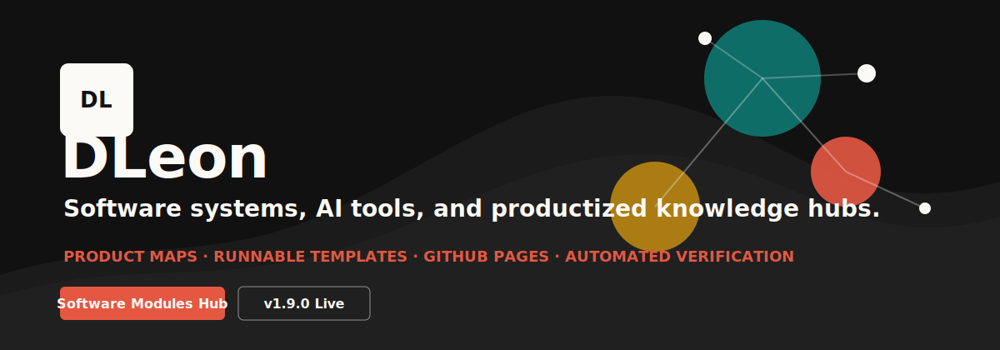

# DLeon

<p align="center">
  
</p>

<p align="center">
  <a href="https://12345mutouren.github.io/software-modules-hub/">
    
  </a>
  <a href="https://github.com/12345mutouren/software-modules-hub">
    
  </a>
  <a href="https://github.com/12345mutouren/software-modules-hub/releases/tag/v2.0.0">
    
  </a>
</p>

## What I Am Building

I am building complete software systems from idea to public release: product maps, account flows, databases, APIs, frontends, security, operations, testing, business features, documentation and deployable knowledge sites.

## Signature Project

| Project | What It Does | Links |
| --- | --- | --- |
| Software Modules Hub | A productized knowledge hub for understanding and building complete software systems. | [Live site](https://12345mutouren.github.io/software-modules-hub/) · [Stack Composer](https://12345mutouren.github.io/software-modules-hub/stack-composer.html) · [Build Planner](https://12345mutouren.github.io/software-modules-hub/planner.html) · [Repository](https://github.com/12345mutouren/software-modules-hub) |

## Current Focus

- Turning raw software knowledge into navigable, visual, production-minded documentation.
- Building runnable templates plus reusable code, data and API foundation packages for SaaS, ecommerce, AI knowledge bases, admin dashboards and AI frontend stacks.
- Using automation, verification and GitHub Actions to keep repositories healthy.
- Designing static knowledge sites that feel like products, not document dumps.

## Software Modules Hub Highlights

| Area | Included |
| --- | --- |
| Knowledge map | 10 core software modules with categories and design checks |
| GitHub index | 121 representative repositories organized by module and type, including CopilotKit / AG-UI |
| Runnable assets | Mini app, module demos, stack templates and business app templates |
| Code foundation | Core, security, auth, data and API packages with tested backend flows |
| Productized docs | GSAP motion, Three.js module network, template selector, stack composer with AI frontend layer, build planner, scorecard and repository browser |
| Release system | Local tests, GitHub Actions, GitHub Pages and release notes |

## Tech I Am Working With

<p>
  
  
  
  
  
  
</p>

## Repository Health

The public project is verified with:

```bash
npm test
```

It checks structure, links, freshness, examples, module demos, generators, runnable templates, runnable apps, code foundation packages, data/API foundation packages, deployment playground and docs-site generation.

## Public Launchpad

| Entry | Status |
| --- | --- |
| Live docs site | Published on GitHub Pages |
| Release workflow | v2.0.0 shipped |
| Verification | Local test suite and GitHub Actions |
| Next build direction | More runnable full-stack templates and planning tools |

## Links

- [Software Modules Hub live site](https://12345mutouren.github.io/software-modules-hub/)
- [Stack Composer](https://12345mutouren.github.io/software-modules-hub/stack-composer.html)
- [Build Planner](https://12345mutouren.github.io/software-modules-hub/planner.html)
- [Software Modules Hub repository](https://github.com/12345mutouren/software-modules-hub)
- [v2.0.0 release notes](https://github.com/12345mutouren/software-modules-hub/releases/tag/v2.0.0)
